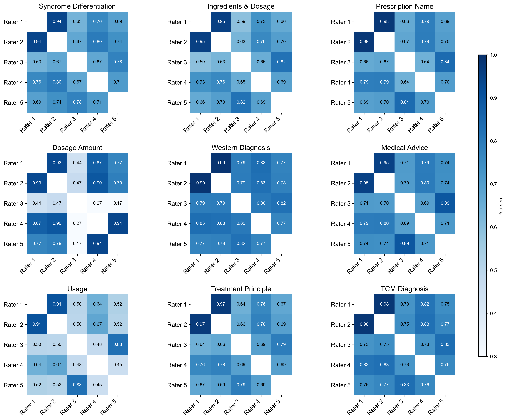

# TCM-Evaluation

This repository accompanies the study:

**Large Language Models Versus Physicians in Traditional Chinese Medicine: A Real-World Clinical Case Evaluation**

The project evaluates contemporary large language models (LLMs) against a physician comparator cohort in a blinded, expert-scored traditional Chinese medicine (TCM) clinical reasoning task. The benchmark uses de-identified real-world outpatient cases and evaluates the generated diagnostic and therapeutic reports across nine TCM and clinical dimensions.

## Project Status

This repository provides public-facing documentation, analysis-code structure, model API-call templates, and aggregate figure previews for a de-identified TCM clinical reasoning benchmark.

Patient-level clinical text, physician reports, LLM outputs, expert scoring records, and source data files are not included in the current public repository. Any future data release will include only materials that have completed de-identification, privacy review, and documentation checks. Restricted elements, if any, will be described through metadata, aggregate summaries, or controlled-access instructions.

## Study Overview

The study compares LLM-generated and physician-generated reports for real-world TCM outpatient cases.

Core design:

- Source cohort: 349 de-identified outpatient cases collected from multiple hospitals.
- Benchmark set: 60 representative clinical cases selected for structured evaluation.
- Human comparator: 60 licensed TCM physicians.
- Model panel: 16 LLMs, including frontier general-purpose models and TCM-specialized models.
- Expert review: five senior TCM experts blinded to respondent identity.
- Scoring: nine diagnostic and therapeutic dimensions, each scored on a five-point Likert scale.
- Main analysis: per-case model scores compared with the human physician baseline using paired tests and false-discovery-rate correction.

Scored dimensions:

- Syndrome differentiation
- TCM diagnosis
- Western diagnosis
- Treatment principle
- Prescription name
- Prescription ingredients and dosage
- Dosage amount
- Usage
- Medical advice

## Models Evaluated

The manuscript evaluates general-purpose and TCM-domain models available during the study period, including:

- GPT-5
- GPT-4o
- OpenAI o3
- Gemini 2.5 Pro
- Claude Opus 4
- Grok 3
- Grok 4
- Llama 4 Maverick
- Doubao 1.6
- Doubao 1.6 Thinking
- Qwen3
- DeepSeek
- BianCang
- HuaTuoGPT-2
- Huatuo
- BenCao

Model names and versions will be documented with their official references or technical reports where available.

## Repository Layout

The repository is organized to support documentation, model API examples, figures, and reproducible analysis resources. Additional cleaned data and code assets may be added through versioned releases as they become available.

```text
TCM-Evaluation/
  README.md
  DATA_AVAILABILITY.md
  requirements.txt
  model_api_calls/
  scripts/
    analysis/
    figures/
    statistics/
  data/
    README.md
    source_cohort_metadata/
    benchmark_cases/
    model_outputs/
    physician_outputs/
    expert_scores/
    source_data/
  figures/
    README.md
    main_figures/
    supplementary_figures/
```

Development files and intermediate analyses are not included unless they are needed for public documentation or reproducibility.

## Model API Calls

Default API-call scripts for the evaluated general-purpose model panel are provided in [`model_api_calls/`](model_api_calls/). Each model has a separate Python file and uses the same clinical prompt, CSV input format, and nine-field output schema:

- 中医诊断
- 辨证证型
- 西医诊断
- 治则
- 处方名
- 成分与克数
- 付数
- 用法
- 医嘱

The default input path is `data/benchmark_cases/60_clinical_cases.csv`, where each row is one patient case. API keys are read from environment variables only and are not stored in the repository.

## Data Release Scope

Potential public research assets, subject to de-identification and privacy review, include:

- De-identified benchmark case records.
- Model-generated reports for all evaluated LLMs.
- Physician-generated reports used as the human comparator.
- Expert scoring records and scoring rubric.
- Source data underlying all main and supplementary figures.
- Scripts for reproducing summary statistics, paired comparisons, multiple-testing correction, heatmaps, box plots, case-level analyses, prescription analyses, and inter-rater analyses.

Files that contain protected health information, direct identifiers, or information that cannot be safely de-identified will not be released. Any restricted fields will be documented in the data dictionary.

## Results Snapshot

The preview figures below show aggregate analyses only and do not contain patient-level clinical text.

### Expert score distributions

Per-case expert score distributions across nine diagnostic and therapeutic dimensions. The human comparator is computed as the per-case mean across physicians, enabling paired case-level comparison with each LLM.


### Expert-rater agreement

Pairwise Pearson correlations among the five blinded expert raters across the nine scoring dimensions.



## Reproducibility Plan

The analysis workflow will support the following steps:

1. Load de-identified benchmark cases and response files.
2. Aggregate expert scores by respondent, case, and scoring dimension.
3. Construct the human physician baseline by averaging physician scores at the case level.
4. Compare each LLM with the human baseline using paired case-level analyses.
5. Apply Benjamini-Hochberg false-discovery-rate correction.
6. Generate main and supplementary figures.
7. Export source data tables for manuscript figures.

The current analysis scripts use Python with common scientific packages, including `pandas`, `numpy`, `scipy`, `statsmodels`, `matplotlib`, and `seaborn`.

## Data and Code Availability

See [DATA_AVAILABILITY.md](DATA_AVAILABILITY.md) for the data-release scope, privacy safeguards, and repository strategy.

## Citation

Formal citation details, DOI, and dataset DOI will be added when a citable version becomes available.

## Contact

For questions about the study or planned data release, please contact the corresponding authors listed in the manuscript.
